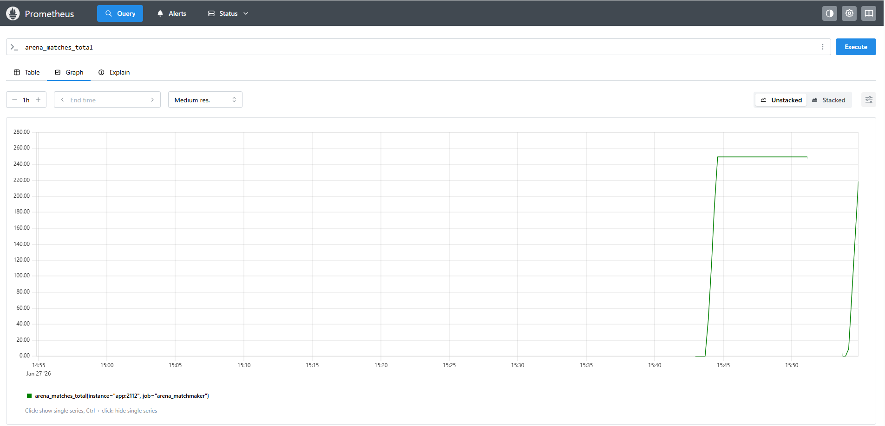

# Arena Matchmaker


A high-performance, distributed matchmaking service built with **Go**, **gRPC**, **Redis**, and **Kubernetes**.

Designed to simulate a production-grade multiplayer backend, handling high-throughput queuing, party management, and infrastructure allocation.

## 🚀 Key Features

* **Microservices Architecture:** Split into scalable `Frontend` (API) and `Worker` (Logic) services.
* **Region-Based Sharding:**
  * Strict data partitioning between regions (e.g., `EU-WEST`, `US-EAST`).
  * Isolated worker pools ensure players only match within their geographical region.
* **Party System (2v2):**
  * Supports **Group Queuing** (Solo or Duo).
  * "Greedy Fill" algorithm intelligently combines Solos and Parties to form full teams of 4.
* **Ranked System:**
  * Full **Elo Rating System** (K-Factor 32) with persistent storage.
  * Handles post-match reporting and MMR updates.
* **Infrastructure Simulation:**
  * Mocks a Game Server Orchestrator (like Agones).
  * Simulates cloud allocation latency and IP assignment for every match.

## 🏗 Architecture

* **Core:** Golang (gRPC Server)
* **Database:** Redis
  * *Sorted Sets:* Partitioned by Region for O(log N) matchmaking.
  * *Hashes:* Persistent storage for Player Stats and Ticket Data.
* **Protocol:** Protobufs (Strict schemas for Parties/Results)
* **Infrastructure:** Docker Compose (Local) & Kubernetes (Cloud)

## 🛠️ How to Run

### 1. Start the Stack (Docker Compose)

Spins up Redis, Prometheus, 1 Frontend, and 2 Region Workers (EU/US).

```bash
docker-compose up --build
```

### 2. Run Stress Test (Queue Latency)

Spawns hundreds of concurrent bots to flood the API.

```bash
python3 simulation/swarm.py
```

### 3. Run Logic Simulation (Parties & Regions)

Simulates a real-world scenario:

* Queues a **Party of 2** and **2 Solos** to form a team.
* Queues players in **EU-WEST** and **US-EAST** simultaneously.
* Verifies that regions never mix and matches are allocated correctly.

```bash
python3 simulation/game_loop.py
```

## Performance

* **Latency:** < 10ms per request under load.
* **Algorithm:** Skill-based matching (MMR) with time-based expansion logic.

## 📊 Observability

The system includes a built-in Prometheus metrics exporter to track real-time performance.

* **Metrics Port:** `:2112`
* **Key Metrics:**
* `arena_queue_depth`: Real-time count of players waiting (per region).
* `arena_matches_total`: Cumulative counter of matches formed.
* `arena_match_latency_seconds`: Histogram of wait times.



* **Ranked System:** Implements a full **Elo Rating System** (K-Factor 32).

  * Tracks player progression persistently across matches.
  * Handles post-match reporting and rating updates via gRPC.

## 🏗 Architecture (Microservices)

The system is split into independent services for scalability:

1. **Frontend Service:** Handles high-throughput gRPC connections, validation, and pushing to Redis. Scalable to N replicas.

2. **Matchmaker Worker:** Singleton background worker that processes the Redis queue and executes the matchmaking logic (Elo).

* **Infrastructure Simulation:**
  * Mocks a Game Server Orchestrator (like Agones).
  * Simulates allocation latency and IP assignment for every match.

## ☁️ Cloud Deployment (Kubernetes)

The project includes full Kubernetes manifests for production deployment.

* **Files:** Located in [`k8s/`](https://www.google.com/search?q=k8s/)
* **Architecture:**
* `redis`: Stateful persistence layer.
* `frontend`: Scaled to 3 replicas behind a LoadBalancer.
* `worker-eu` / `worker-us`: Independent deployments for horizontal scaling.

**Deploy locally (Minikube/Kind):**

```bash
kubectl apply -f k8s/
```

## 🛡️ Quality Assurance (CI/CD)

* **Pipeline:** GitHub Actions (`.github/workflows/go.yml`)
* **Tests:** Automated Unit Tests (`pkg/logic/elo_test.go`) run on every push to ensure algorithmic integrity.
